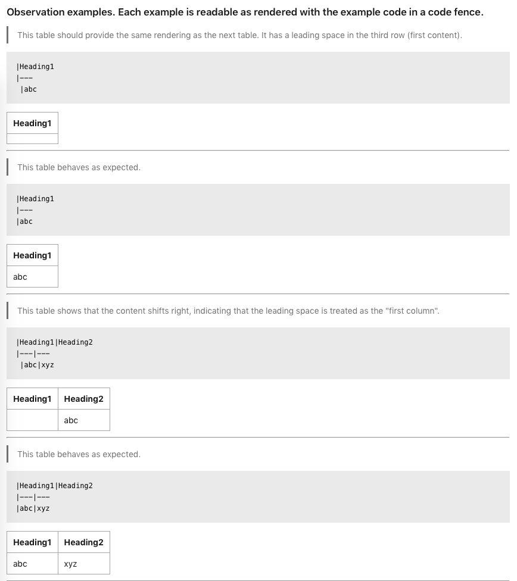
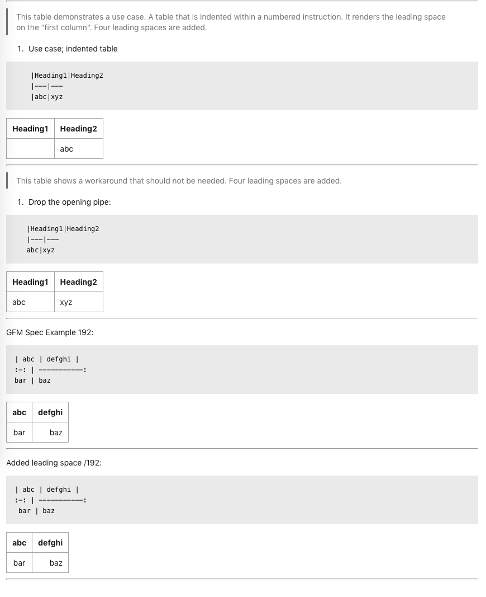

!!! GOOD NEWS! Microsoft says, "A fix for this issue has been internally implemented and is being prepared for release. We'll update you once it becomes available."

## Bug Report - Azure DevOps markdown rendering of tables does not respect indented opening pipes

!!!! Get the [raw markdown](http://matchavez.com/user/pages/02.projects-and-notes/10.azure-devops-table-render-bug/default.md) of this page

 #### Problem
 In any known case where Azure DevOps is rendering a table that has been indented, the treatment of the first row of content (commonly the third row of a table) does not respect the opening pipe character. This offsets content from its header by one column to the right.

 #### Observations

 Please see the examples listed below. The examples will show that leading spaces are considered a column as indicated in [GFM Spec example 192](https://github.github.com/gfm/#tables-extension-). This respect of no need for a lead pipe only occurs under indented rows after the table indicators of pipe-and-three-dashes.

 #### Expectation

 In line with all other tested editors, including VSCode Preview, the opening absence should be respected in any table format, but if the first character encountered after only spaces is a pipe, the rendering should handle the content as an opening column external border, not the first interior column separator.

 #### Correction

Rendering should be done in a consistent manner with GFM and all other known interpretations, as the opening pipe is respected in Azure DevOps iff the pipe has no leading characters in the line.


### Observation examples. Each example is readable as rendered with the example code in a code fence.

! _These screen captures are from Azure DevOps. Indented, leading pipes are treated as the border between the "first and second" columns, differently than non-indented tables and against spec._





---

!!!! _These are the same examples, but just rendered out in here, via Grav CMS. The examples all render properly, and would be what is expected based on an appropriate treatment of an indented leading pipe._

> This table should provide the same rendering as the next table. It has a leading space in the third row (first content).

```
|Heading1
|---
 |abc
```

|Heading1
|---
 |abc

---

> This table behaves as expected.

```
|Heading1
|---
|abc
```

|Heading1
|---
|abc

---

> This table shows that the content shifts right, indicating that the leading space is treated as the "first column".

```
|Heading1|Heading2
|---|---
 |abc|xyz
```

 |Heading1|Heading2
|---|---
 |abc|xyz

---

> This table behaves as expected.

```
|Heading1|Heading2
|---|---
|abc|xyz
```

|Heading1|Heading2
|---|---
|abc|xyz

---

> This table demonstrates a use case. A table that is indented within a numbered instruction. It renders the leading space on the "first column". Four leading spaces are added.

1. Use case; indented table
```
    |Heading1|Heading2
    |---|---
    |abc|xyz
```

    |Heading1|Heading2
    |---|---
    |abc|xyz

---

> This table shows a workaround that should not be needed. Four leading spaces are added.

1. Drop the opening pipe:
 
 ```
    |Heading1|Heading2
    |---|---
    abc|xyz
```

    |Heading1|Heading2
    |---|---
    abc|xyz

---
GFM Spec Example 192:

```
| abc | defghi |
:-: | -----------:
bar | baz
```

| abc | defghi |
:-: | -----------:
bar | baz

---

Added leading space /192:

```
| abc | defghi |
:-: | -----------:
 bar | baz
```

 | abc | defghi |
:-: | -----------:
 bar | baz

 ---
